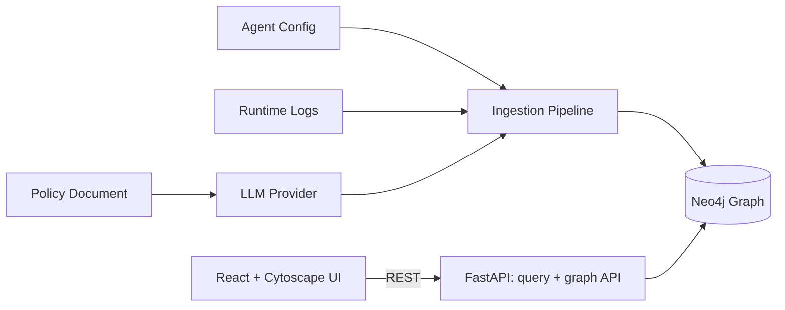
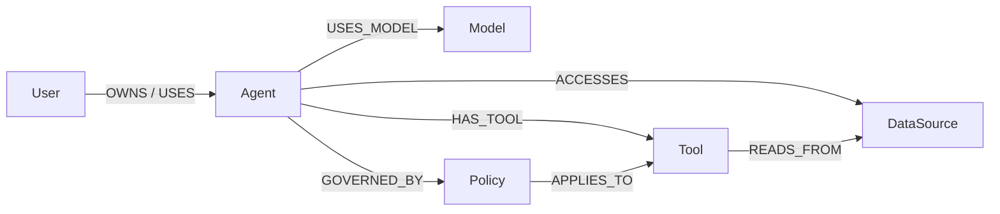
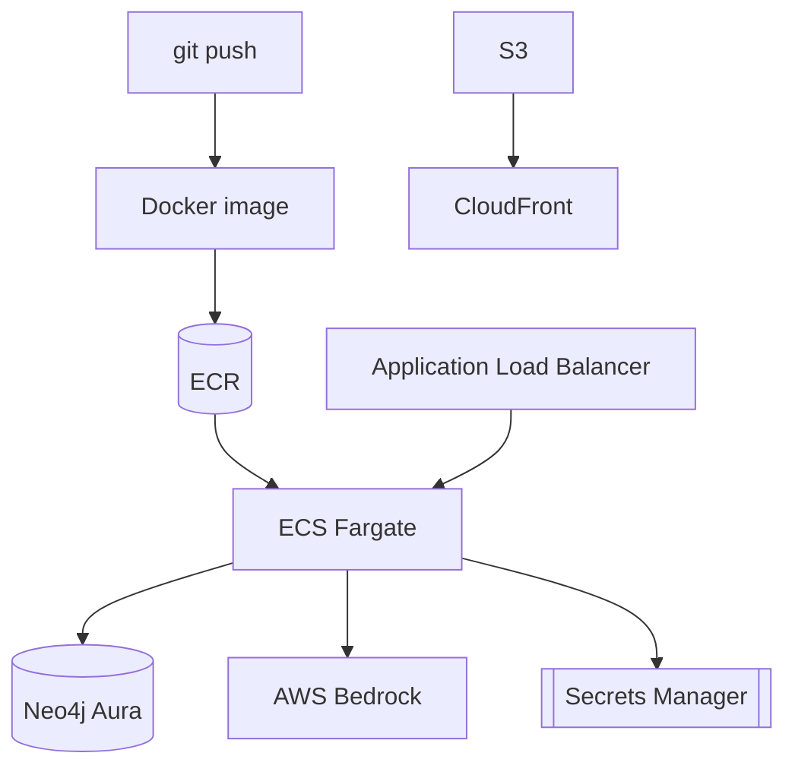

# Governance Graph Builder

A governance graph that models **agents, models, tools, users, data sources, and policies** as connected nodes — making the full composition of any AI agent queryable, auditable, and visualizable in one place.

Modern AI agents are compositions: an LLM, an orchestration layer, a set of tools, a memory store, and the data sources they can reach. Those pieces usually live in separate systems — the model in a registry, the tools undocumented, the data in a catalogue. When something goes wrong, no one can reconstruct what was connected to what. This project unifies those facts into a single graph and answers governance questions over it.

---

## Table of Contents

- [Highlights](#highlights)
- [Architecture](#architecture)
- [Graph Data Model](#graph-data-model)
- [Tech Stack](#tech-stack)
- [Repository Layout](#repository-layout)
- [Getting Started](#getting-started)
- [Sample Data](#sample-data)
- [Governance Queries](#governance-queries)
- [API Reference](#api-reference)
- [Ingestion Model](#ingestion-model)
- [LLM Integration](#llm-integration)
- [Configuration](#configuration)
- [Production Readiness](#production-readiness)
- [Deployment (AWS)](#deployment-aws)
- [Success Criteria](#success-criteria)

---

## Highlights

- **Unified graph** of six governance entity types with typed relationships, backed by Neo4j.
- **Three-source ingestion** — declarative agent configs (YAML/JSON), runtime logs (JSONL), and natural-language policy documents parsed by a real LLM.
- **Governance queries** answering "what can this agent reach?", "who uses this model?", "which agents touch this data source (directly *or* transitively)?", and "which agents have no policy?".
- **Blast-radius analysis** — given a compromised tool, find every affected agent, user, and exposed data source.
- **Config/runtime drift detection** — relationships observed at runtime but never declared in config are surfaced automatically.
- **Correct updates** — re-ingesting a changed agent config reconciles the graph, removing stale edges (and downgrading still-observed ones to drift rather than deleting them).
- **Interactive visualization** — a React + Cytoscape UI that renders the graph, highlights query results, and drives ingestion.
- **Production-ready** — async API with structured logging, health/readiness probes, global error handling, autoscaling-ready containers, and full Terraform for AWS.

---

## Architecture



The React UI calls the FastAPI service over REST. The API runs parameterized Cypher against Neo4j. Ingestion normalizes each of the three sources into the same node/edge model; the natural-language policy document is parsed by an LLM into structured policies before it reaches the graph.

---

## Graph Data Model

**Node types:** `User`, `Agent`, `Model`, `Tool`, `DataSource`, `Policy`.



Two properties on relationships make governance analysis possible:

- **`declared`** — the edge came from an agent config (the intended composition).
- **`observed`** — the edge was seen in runtime logs (what actually happened).

An edge that is `observed` but not `declared` is **drift**. Data-source access is evaluated both **directly** (`Agent-[:ACCESSES]->DataSource`) and **transitively** (`Agent-[:HAS_TOOL]->Tool-[:READS_FROM]->DataSource`).

`id` is the stable merge key for every node; `name` is the human-facing identifier the queries look entities up by. Uniqueness constraints and name indexes are applied automatically at startup.

---

## Tech Stack

| Layer | Choice |
|-------|--------|
| Graph database | Neo4j (Neo4j 5.x locally via Docker; Neo4j Aura in the cloud) |
| Backend | Python 3.12, FastAPI, async Neo4j driver, managed with `uv` |
| App server | Gunicorn + Uvicorn workers (concurrent) |
| LLM | AWS Bedrock (Claude) primary; OpenAI / Anthropic optional; deterministic heuristic fallback |
| Frontend | React 19 + TypeScript + Vite, Cytoscape for graph rendering |
| Containers | Docker (backend uv image, frontend nginx image) |
| Infrastructure | Terraform — ECR, VPC, ECS Fargate + ALB, S3 + CloudFront, Secrets Manager, IAM, CloudWatch |

---

## Repository Layout

```
Governance Graph Builder/
├── backend/                  FastAPI service (Python, uv)
│   ├── app/
│   │   ├── main.py           App factory: lifespan, middleware, error handling
│   │   ├── config.py         Environment-based settings
│   │   ├── logging_config.py Structured JSON logging + request ids
│   │   ├── api/              health, ingest, query, graph routers + schemas
│   │   ├── graph/            Neo4j client, schema, loader (+ reconciliation), queries, seed
│   │   ├── ingestion/        agent_config, runtime_logs, policy_doc, pipeline
│   │   ├── llm/              provider abstraction + bedrock/openai/anthropic/heuristic
│   │   └── models/           Pydantic node/edge/graph models
│   ├── samples/{simple,medium,complex}/   agent_config.yaml + runtime_logs.jsonl + policy.md
│   └── Dockerfile
├── frontend/                 React + Vite + TypeScript UI
│   ├── src/{api,components}/  typed client + GraphView / QueryPanel / IngestPanel / StatsBar
│   ├── Dockerfile            multi-stage build -> nginx
│   └── nginx.conf
├── infra/
│   ├── docker-compose.yml    local Neo4j + backend
│   └── terraform/            AWS infrastructure as code (+ its own README)
├── plan.md                   engineering plan
├── tasks.md                  phased task tracker
└── problem_statement.md
```

---

## Getting Started

### Prerequisites

- [uv](https://docs.astral.sh/uv/) (Python 3.12)
- Node.js 20.19+ or 22.12+
- Docker (for Neo4j locally)

### 1. Start Neo4j and the backend

From the repository root:

```bash
# Start Neo4j
docker compose -f infra/docker-compose.yml up -d neo4j

# Run the API
cd backend
uv sync
uv run uvicorn app.main:app --reload --port 8000
```

A `.env` is optional locally — defaults match the Docker Neo4j. Interactive API docs are at **http://localhost:8000/docs**; liveness at `/health`, readiness at `/ready`.

Alternatively, run the whole stack (Neo4j + backend) in containers:

```bash
docker compose -f infra/docker-compose.yml up --build
```

### 2. Start the frontend

```bash
cd frontend
npm install
npm run dev
```

Open the printed URL (default **http://localhost:5173**). The backend already allows this origin via CORS.

### 3. Load data and explore

Ingest a sample bundle from the UI's **Ingest** panel, or via the API:

```bash
curl -X POST http://localhost:8000/ingest/bundle \
  -H "Content-Type: application/json" \
  -d '{"bundle":"complex","reset":true}'
```

Then run the governance queries from the **Query** panel and watch the matching subgraph highlight.

---

## Sample Data

Three bundles of increasing complexity live in `backend/samples/`. Each contains an agent config, a runtime log, and a policy document.

| Bundle | What it exercises |
|--------|-------------------|
| `simple` | One of each node type; all queries; no orphan |
| `medium` | Multiple agents, a shared model, one policy governing two agents, and **one intentionally policy-free (orphan) agent** |
| `complex` | Transitive data access, overlapping policies (an agent with two policies), a non-owning user, an orphan agent, and **config/runtime drift** (a tool invoked at runtime but never declared) |

---

## Governance Queries

The four required queries (from the problem statement), plus the bonus and extras, are all exposed over HTTP and in the UI:

| Question | Endpoint |
|----------|----------|
| What tools does Agent X have access to? | `GET /agents/{name}/tools` |
| Which agents are using Model Y? | `GET /models/{name}/agents` |
| Which agents can access DataSource Z? (direct + transitive) | `GET /datasources/{name}/agents` |
| Is there any agent with no policy attached? | `GET /agents/orphans` |
| **Blast radius:** which agents/users/data are affected by a compromised tool? | `GET /tools/{name}/blast-radius` |
| Where does runtime usage diverge from declared config? | `GET /graph/drift` |

---

## API Reference

| Method | Path | Purpose |
|--------|------|---------|
| GET | `/health` | Liveness probe |
| GET | `/ready` | Readiness probe (checks Neo4j) |
| POST | `/ingest/agent-config` | Ingest an agent config (raw text or object) |
| POST | `/ingest/runtime-logs` | Ingest runtime logs (JSONL or records) |
| POST | `/ingest/policy` | Ingest a policy document (LLM-parsed) |
| POST | `/ingest/bundle` | Ingest a full sample bundle |
| POST | `/ingest/upload` | Ingest any source from an uploaded file |
| GET | `/ingest/bundles` | List available sample bundles |
| GET | `/graph` | Full node/edge snapshot for visualization |
| DELETE | `/graph` | Reset the graph |
| GET | `/graph/stats` | Node/edge counts, orphan/drift counts, active LLM provider |
| GET | `/graph/entities/{label}` | List entities of a type (search + limit) |
| GET | `/graph/neighbors/{name}` | Subgraph around a node |
| GET | `/graph/drift` | Observed-but-undeclared relationships |

Full interactive documentation (OpenAPI/Swagger) is served at `/docs`.

---

## Ingestion Model

The graph is built from three heterogeneous sources, each normalized into the same node/edge model:

1. **Agent config (YAML/JSON)** — the authoritative *structural* source. Declares each agent with its owner/users, model, tools, direct data-source access, tool→data-source reads, and governing policies. Supports a single agent or a fleet via a top-level `agents:` list. Edges are tagged `declared`.

2. **Runtime logs (JSONL)** — observed usage from a sample agent run (`model_invoke`, `tool_call`, `data_read`). Adds `observed` metadata (occurrence counts, `last_seen`) and surfaces **drift** when logs reference entities the config never declared.

3. **Policy document (Markdown/text)** — a manually authored, natural-language document. An **LLM** extracts structured policies (type, rules, which agents they govern, which entities they apply to), which are grounded against the existing graph and written as enriched `Policy` nodes plus `GOVERNED_BY` and `APPLIES_TO` edges.

Loading is idempotent (`MERGE`), so re-ingestion updates in place. Re-ingesting a **changed** agent config reconciles its declared edges to match the new config: stale edges are removed, and an edge that is still observed at runtime (or asserted by a policy document) is downgraded to drift rather than deleted.

---

## LLM Integration

Policy-document parsing goes through a provider abstraction with graceful fallback:

- **AWS Bedrock** (Claude via the Converse API) — the primary real provider. Credentials resolve from the standard AWS chain (environment, shared config, or the ECS task role in production), so no secrets live in code.
- **OpenAI / Anthropic** — optional direct providers (lazy-loaded SDKs).
- **Heuristic** — a deterministic, offline extractor that parses the document structurally and grounds references against the known graph vocabulary. Always available, so the system runs fully locally with no credentials.

The active provider is selected by `LLM_PROVIDER` (default `auto`: use the first available real provider, otherwise the heuristic). The current provider is reported at `GET /graph/stats`.

---

## Configuration

Backend settings come from environment variables (or a local `.env`; see `backend/.env.example`).

| Variable | Default | Description |
|----------|---------|-------------|
| `ENVIRONMENT` | `development` | Deployment environment |
| `LOG_LEVEL` / `LOG_JSON` | `INFO` / `true` | Logging level and JSON output |
| `CORS_ORIGINS` | localhost dev origins | Comma-separated allowed origins |
| `NEO4J_URI` | `bolt://localhost:7687` | Neo4j Bolt URI |
| `NEO4J_USER` / `NEO4J_PASSWORD` | `neo4j` / `localdevpassword` | Neo4j credentials |
| `NEO4J_DATABASE` | `neo4j` | Neo4j database name |
| `LLM_PROVIDER` | `auto` | `auto` \| `bedrock` \| `openai` \| `anthropic` \| `heuristic` |
| `AWS_REGION` | `us-east-1` | Region for Bedrock |
| `BEDROCK_MODEL_ID` | Claude 3.5 Sonnet | Bedrock model / inference profile |
| `OPENAI_API_KEY` / `ANTHROPIC_API_KEY` | unset | Optional direct-provider keys |

The frontend reads `VITE_API_BASE_URL` (default `http://localhost:8000`); see `frontend/.env.example`.

---

## Production Readiness

- **Concurrency** — async FastAPI served by Gunicorn with multiple Uvicorn workers; the Neo4j driver maintains a connection pool.
- **Persistence** — Neo4j (managed Aura in the cloud); no in-memory-only state.
- **Observability** — structured JSON logs with per-request correlation ids, ready for CloudWatch Logs Insights.
- **Health** — `/health` (liveness) and `/ready` (dependency readiness) wired to container and load-balancer checks.
- **Error handling** — global handlers return a consistent `{ "error": { "type", "message" } }` envelope with the correlation id.
- **Config & secrets** — 12-factor configuration; Neo4j credentials injected from AWS Secrets Manager in production.
- **Security** — least-privilege IAM task roles, private-subnet tasks behind an ALB, CORS lockdown, and injection-safe parameterized Cypher.

---

## Deployment (AWS)

The `infra/terraform/` directory provisions a production-shaped stack:

- **ECR** for the backend image
- **VPC** (public + private subnets, NAT)
- **ECS Fargate + ALB** for the API, with CPU-based autoscaling
- **S3 + CloudFront** (Origin Access Control) for the frontend
- **Secrets Manager** for Neo4j credentials, **IAM** roles (execution + Bedrock task role), and **CloudWatch Logs**



The graph database is managed **Neo4j Aura**, provisioned separately and passed in as variables. Step-by-step deployment instructions (init, apply, image push, frontend sync) are in [`infra/terraform/README.md`](infra/terraform/README.md).

---

## Success Criteria

All requirements from the problem statement are implemented and verified against the three sample bundles:

- **Correct graph build + accurate queries** across the `simple`, `medium`, and `complex` configs.
- **Orphan-agent query** correctly flags the intentionally policy-free agent (and only it).
- **Correct updates** when an agent config changes — stale edges are reconciled away.
- **Bonus:** the **blast-radius query** returns the affected agents, users, and exposed data sources for a compromised tool.

See [`plan.md`](plan.md) for the full engineering plan and [`tasks.md`](tasks.md) for the phased implementation tracker.
