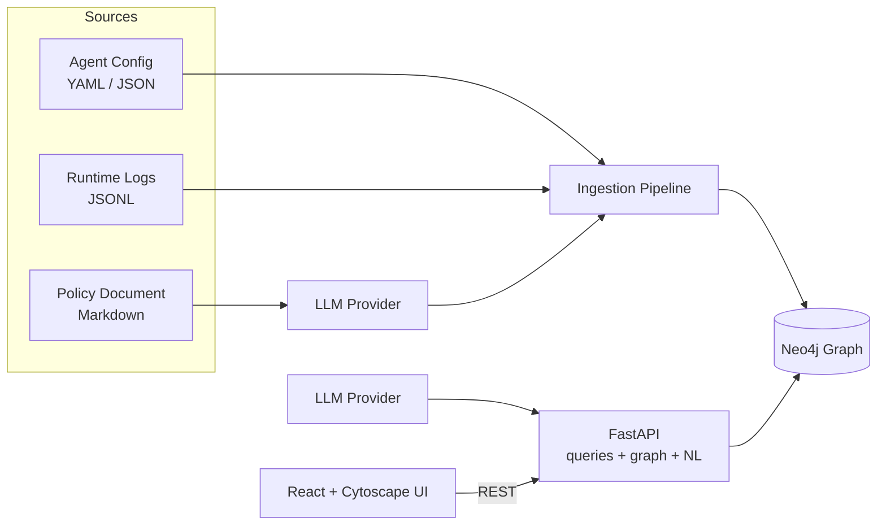

# Governance Graph Builder — Write-Up

## 1. Summary

The Governance Graph Builder unifies the scattered facts about an AI agent — the model it runs on, the tools it can call, the data sources it can reach, the people who own and use it, and the policies that govern it — into a single, queryable Neo4j graph. It ingests three heterogeneous sources (a declarative agent config, runtime logs, and a natural-language policy document), answers governance questions over the result, and renders the graph in an interactive UI.

It is deployed and running on AWS, not just locally:

**Live app + API:** `http://ggb-prod-alb-287388877.us-east-1.elb.amazonaws.com`

A single container serves both the React UI and the FastAPI backend; the graph is stored in managed Neo4j Aura.

---

## 2. The Problem and the Approach

An agent is a composition — an LLM, an orchestration layer, tools, memory, and data sources — but those pieces are tracked in separate systems. When something breaks, no one can reconstruct what was connected to what.

The approach is to treat governance as a **graph problem**:

1. **Normalize** three very different inputs into one node/edge model.
2. **Distinguish intent from reality** — every edge records whether it was *declared* in config, *observed* at runtime, or both. The gap between the two is drift.
3. **Answer questions by traversal** — reachability, shared usage, orphaned agents, and blast radius are all natural graph queries.
4. **Make it usable and operable** — a visual UI, a natural-language query box, and a production deployment on AWS.

---

## 3. What Was Built (mapped to the requirements)

| Requirement | Delivered |
|-------------|-----------|
| Graph data model (`User`, `Agent`, `Model`, `Tool`, `DataSource`, `Policy`) | Neo4j graph with typed relationships and uniqueness constraints |
| Ingestion from three sources | Agent config (YAML/JSON), runtime logs (JSONL), policy document (LLM-parsed) |
| Query: tools an agent can access | `GET /agents/{name}/tools` |
| Query: agents using a model | `GET /models/{name}/agents` |
| Query: agents that can access a data source | `GET /datasources/{name}/agents` (direct **and** transitive) |
| Query: agents with no policy (orphans) | `GET /agents/orphans` |
| Visual graph render | React + Cytoscape UI |
| Correct updates on config change | Edge reconciliation (stale edges removed; still-observed edges downgraded to drift) |
| **Bonus** — blast radius of a compromised tool | `GET /tools/{name}/blast-radius` |

Beyond the brief, two additions materially raise the value of the tool:

- **Config/runtime drift detection** — relationships seen in logs but never declared are surfaced automatically (`GET /graph/drift`).
- **Natural-language querying** — ask a question in plain English and get the matching subgraph back (`POST /graph/nl-query`).

---

## 4. Architecture



A single ECS service runs FastAPI, which also serves the compiled React SPA — so the UI and API share one origin (no CORS, no second host to operate). The API runs parameterized Cypher against Neo4j Aura. The LLM provider is used in two places: parsing the policy document during ingestion, and translating natural-language questions into read-only Cypher.

**Stack:** Python 3.12 / FastAPI (async) · Neo4j (Aura in the cloud, Docker locally) · React 19 + TypeScript + Vite + Cytoscape · Gunicorn + Uvicorn workers · Terraform-provisioned AWS (ECS Fargate, ALB, ECR, Secrets Manager, IAM, CloudWatch).

---

## 5. Graph Data Model

Six node types: `User`, `Agent`, `Model`, `Tool`, `DataSource`, `Policy`.

```
(User)-[:OWNS|USES]->(Agent)
(Agent)-[:USES_MODEL]->(Model)
(Agent)-[:HAS_TOOL]->(Tool)
(Agent)-[:ACCESSES]->(DataSource)
(Tool)-[:READS_FROM]->(DataSource)
(Agent)-[:GOVERNED_BY]->(Policy)
(Policy)-[:APPLIES_TO]->(Tool | DataSource | Model)
```

Two properties on every relationship make governance analysis possible:

- **`declared`** — the edge came from an agent config (intended composition).
- **`observed`** — the edge was seen in runtime logs (what actually happened).

An edge that is `observed` but not `declared` is **drift**. Data-source access is evaluated both **directly** (`Agent-[:ACCESSES]->DataSource`) and **transitively** (`Agent-[:HAS_TOOL]->Tool-[:READS_FROM]->DataSource`), so the "who can reach this data?" question captures indirect access through tools.

`id` is the stable merge key for every node; `name` is the human-facing identifier queries look up. Uniqueness constraints and name indexes are created at startup.

---

## 6. Ingestion Layer

Each of the three sources is normalized into the same node/edge model.

1. **Agent config (YAML/JSON)** — the authoritative structural source. Declares each agent with its owner/users, model, tools, direct data-source access, tool→data-source reads, and governing policies. Accepts a single agent or a fleet via a top-level `agents:` list. Edges are tagged `declared`.

2. **Runtime logs (JSONL)** — observed usage from a sample run (`model_invoke`, `tool_call`, `data_read`). Adds `observed` metadata (occurrence counts, last-seen) and surfaces drift when logs reference entities the config never declared.

3. **Policy document (Markdown/text)** — a manually authored, natural-language document. An **LLM** extracts structured policies (type, rules, which agents they govern, which entities they apply to). The extraction is grounded against the current graph vocabulary and written as enriched `Policy` nodes plus `GOVERNED_BY` and `APPLIES_TO` edges.

Loading is idempotent (`MERGE`), so re-ingestion updates in place. Re-ingesting a **changed** config reconciles its declared edges to the new config: stale edges are removed, and an edge that is still observed at runtime (or asserted by a policy) is downgraded to drift rather than deleted — so history is not silently lost.

---

## 7. Queries and Analysis

All queries are exposed over HTTP and in the UI's Query panel, which highlights the matching subgraph.

| Question | Endpoint |
|----------|----------|
| What tools does Agent X have access to? | `GET /agents/{name}/tools` |
| Which agents are using Model Y? | `GET /models/{name}/agents` |
| Which agents can access DataSource Z? (direct + transitive) | `GET /datasources/{name}/agents` |
| Which agents have no policy attached? | `GET /agents/orphans` |
| Blast radius of a compromised tool (agents, users, exposed data) | `GET /tools/{name}/blast-radius` |
| Where does runtime usage diverge from declared config? | `GET /graph/drift` |

The **blast-radius** query answers the incident-response question directly: given a compromised tool, it walks back to every agent that has it, every user of those agents, and every data source they can reach — the full set of potentially affected entities.

---

## 8. Natural-Language Querying

The UI includes an **Ask AI** box: type a question in plain English and the matching subgraph is rendered. Because letting a model author database queries is the riskiest part of such a feature, the pipeline is deliberately safety-first:

1. **Generate** — the LLM turns the question into a single Cypher statement, grounded by the fixed graph schema and instructed to return whole nodes and relationships.
2. **Validate** — a read-only gate rejects anything that is not a single read statement (no `CREATE`/`MERGE`/`DELETE`/`SET`/`REMOVE`/`DROP`, no `LOAD CSV`, no `db.`/`dbms.`/`apoc.` procedure calls, no stacked statements) and caps results with a `LIMIT`.
3. **Execute** — the statement runs inside a **read transaction**, so any write that somehow slipped past validation is refused by the database itself (defense in depth). Relationships among the returned nodes are backfilled so the subgraph renders connected.
4. **Return** — the response includes the executed Cypher (for transparency), a short explanation, and the subgraph.

If the active provider cannot author Cypher (the offline heuristic), the endpoint returns a clear `503` rather than failing unpredictably.

---

## 9. Production Readiness

This was treated as a first-class requirement, not an afterthought.

- **Deployed on AWS** — not localhost. ECS Fargate service behind an Application Load Balancer, image in ECR, all provisioned by Terraform (`infra/terraform/`). The live URL is above.
- **Concurrency** — async FastAPI served by Gunicorn with multiple Uvicorn workers; the Neo4j driver maintains a connection pool. Requests are non-blocking end to end.
- **Persistence** — managed Neo4j Aura; no in-memory-only state, so restarts and scaling don't lose the graph.
- **Autoscaling** — CPU-based target tracking on the ECS service.
- **Observability** — structured JSON logs with a correlation id per request, ready for CloudWatch Logs Insights.
- **Health** — `/health` (liveness) and `/ready` (checks Neo4j connectivity) wired to the container and load-balancer checks.
- **Error handling** — global handlers return a consistent `{ "error": { "type", "message" } }` envelope with the correlation id; a failing LLM call during ingestion falls back to the deterministic heuristic instead of returning a 500.
- **Secrets** — Neo4j credentials and the LLM API key are injected from AWS Secrets Manager via a least-privilege execution role; no secrets in code or the image.
- **Real LLM integration** — a provider abstraction supports a generic OpenAI-compatible provider (used in the deployment), AWS Bedrock, OpenAI, and Anthropic, with a deterministic heuristic as an always-available fallback so the system also runs fully offline.
- **Infrastructure as code** — the entire stack is reproducible with `terraform apply`; task-definition changes roll out with zero-downtime deployments.

---

## 10. Meeting the Success Criteria

The success criteria are verified by an automated suite (`backend/scripts/validate.py`) that ingests the three bundles and asserts every query result. It was run against the **live deployed URL** — all 22 checks pass.

| Criterion | Evidence |
|-----------|----------|
| Correct graph build + accurate queries across `simple`, `medium`, `complex` | All per-bundle query assertions pass |
| Orphan-agent query returns the intentionally policy-free agent (and only it) | Asserted per bundle (`medium` → one orphan; `complex` → one orphan) |
| Graph updates correctly when a config changes | The suite ingests a changed config and asserts stale edges are reconciled away |
| Bonus: blast-radius query | Asserted — returns the expected affected agents, users, and exposed data |

The `complex` bundle specifically exercises transitive data access, an agent governed by two policies, a non-owning user, an orphan agent, and config/runtime drift.

---

## 11. Key Design Decisions and Trade-offs

- **Neo4j over an in-memory graph** — the questions are inherently multi-hop (transitive data access, blast radius), which Cypher expresses cleanly; a managed Aura instance also satisfies the persistence requirement.
- **ECS Fargate over Lambda** — the Neo4j driver benefits from a warm connection pool, and a long-lived container avoids per-request cold-start and connection churn. REST over WebSockets because the interaction is request/response.
- **Unified container over separate frontend hosting** — FastAPI serves the built SPA, so the UI and API share one origin. This removed CORS complexity and a second deployment target, and sidestepped a CDN dependency, at the cost of not having an edge cache (acceptable for this workload).
- **`declared` vs `observed` edges** — rather than modelling config and runtime as separate graphs, a single graph with provenance flags makes drift a trivial query and keeps the model small.
- **Read-only-by-construction NL queries** — static validation plus a read transaction means the natural-language feature cannot mutate the graph even under prompt injection.
- **LLM provider abstraction with heuristic fallback** — real LLM parsing when a provider is configured, deterministic parsing when not, so the system is never hard-blocked on an external dependency.

---

## 12. How to Try It

**Deployed:** open `http://ggb-prod-alb-287388877.us-east-1.elb.amazonaws.com`, ingest a bundle from the Ingest panel (or it may already be seeded), then use the Query panel and the Ask AI box.

**Locally:**

```bash
# Neo4j + backend
docker compose -f infra/docker-compose.yml up -d neo4j
cd backend && uv sync && uv run uvicorn app.main:app --reload --port 8000

# Frontend
cd frontend && npm install && npm run dev
```

Ready-to-upload sample files (one per format — JSON, YAML, Markdown, TXT) live in `test-files/` for exercising the ingestion paths by hand.

---

## 13. Limitations and Future Work

- **Transport security / auth** — the load balancer currently serves HTTP and the API is unauthenticated. The Terraform already supports an ACM certificate; the next hardening steps are HTTPS termination and an auth layer (API key or OIDC) with per-role access.
- **Streaming ingestion** — runtime logs are ingested as batches; a streaming path (e.g. from a log pipeline) would keep the graph continuously current.
- **Historical drift** — drift is computed against the latest state; retaining time-series of observations would enable "when did this edge first appear?" analysis.
- **Richer policy semantics** — policies are modelled as governance edges; evaluating policy *rules* against observed behavior (automated compliance checks) is a natural extension.

---

## 14. Repository Map

- `backend/` — FastAPI service (API, graph client + queries, ingestion, LLM providers).
- `frontend/` — React + Cytoscape UI.
- `infra/terraform/` — AWS infrastructure as code.
- `test-files/` — ready-to-upload sample inputs.
- `README.md` — full reference documentation; `plan.md` and `tasks.md` — engineering plan and phased tracker.
