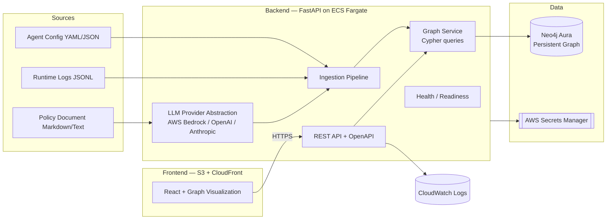
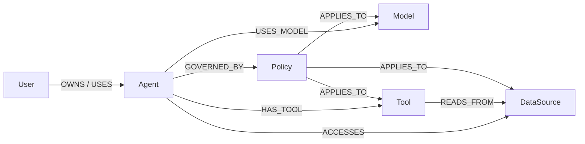
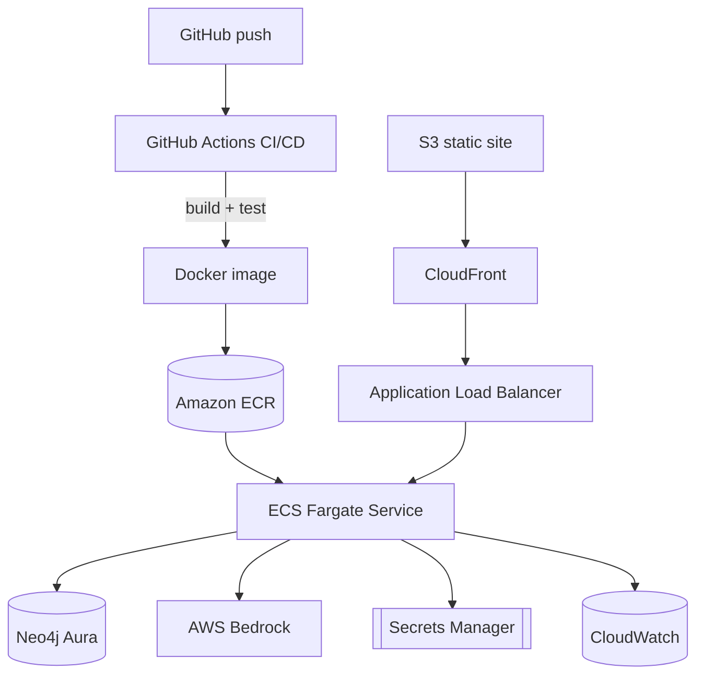

# Governance Graph Builder — Build Plan

> A production-ready governance graph that models **agents, models, tools, users, data sources, and policies** as connected nodes, making the full composition of any AI agent queryable, visualizable, and auditable in one place.

This plan turns the [problem statement](./problem_statement.md) into an executable, phased engineering roadmap that satisfies the [production-readiness bar](./instruction.md): deployed on AWS, backed by a persistent graph database, exposing a concurrent API, wired to a real LLM provider, with logging, error handling, and health checks.

---

## 1. Objectives & Success Criteria

### 1.1 What we are building
A system that ingests the scattered facts about an AI agent's composition (its LLM, tools, data sources, owners, and governing policies) from **three heterogeneous sources**, unifies them into a single **graph**, and answers governance questions over that graph through an **API** and a **visual render**.

### 1.2 Success criteria (traceable to the problem statement)

| # | Criterion | How this plan satisfies it |
|---|-----------|----------------------------|
| SC1 | Three sample agent configs of increasing complexity build correctly; all queries return accurate results | Phase 2 + Phase 8: `simple`, `medium`, `complex` sample bundles + validation suite |
| SC2 | Orphan agent query returns correct results when one agent is left policy-free | `medium`/`complex` samples intentionally include a policy-free agent; dedicated `/agents/orphans` query |
| SC3 | Graph updates correctly when an agent config changes | Idempotent `MERGE`-based ingestion + re-ingest/update endpoint + stale-edge reconciliation |
| Bonus | Blast radius: given a compromised tool, which agents and users are affected | `/tools/{name}/blast-radius` traversal query |

### 1.3 Production-readiness targets (from `instruction.md`)
- Deployed on **AWS** (ECS Fargate + managed Neo4j Aura) — not localhost-only.
- **Concurrent request handling**, **persistent state**, and a **usable REST API** with OpenAPI docs.
- **Structured logging**, **global error handling**, **liveness/readiness health checks**.
- Connected to **a real LLM provider** (AWS Bedrock primary, provider-abstracted) — used for policy-document parsing, not mocked.
- Infrastructure-as-code, CI/CD, and containerization so an enterprise could adopt it with minimal rework.

---

## 2. Architecture Overview



**Request flow:** the React UI calls the FastAPI service over HTTPS (through an ALB). The API delegates to a Graph Service that runs parameterized Cypher against Neo4j Aura. Ingestion normalizes the three sources into the same node/edge model; the policy document is parsed by a real LLM into structured policy rules before being written to the graph.

---

## 3. Tech Stack & Rationale

| Layer | Choice | Why |
|-------|--------|-----|
| Graph database | **Neo4j** (Neo4j Aura managed in cloud; Neo4j Docker locally) | Native property graph; Cypher maps 1:1 to the required queries; managed persistence + concurrency; first-class visualization exports |
| Backend framework | **FastAPI** (Python 3.12, `uv`) | Async concurrency, automatic OpenAPI docs, Pydantic validation, trivial health checks; matches existing `backend/` scaffold |
| App server | **Uvicorn + Gunicorn workers** | Multi-worker concurrency in production containers |
| LLM provider | **AWS Bedrock (Claude)** primary, abstracted to also support OpenAI / Anthropic direct | Satisfies "real LLM provider" + AWS integration bonus; abstraction avoids lock-in |
| Frontend | **React 19 + TypeScript + Vite** (existing scaffold) | Already in repo |
| Graph visualization | **Cytoscape.js** (`react-cytoscapejs`) primary; `react-force-graph` as alternative | Production-grade layouts, styling per node type, interaction/expand, large-graph performance |
| Containerization | **Docker** (multi-stage) | Parity between local and cloud |
| Cloud compute | **AWS ECS Fargate** behind an **ALB** | Serverless containers, native concurrency, persistent DB connection pools (cleaner than Lambda for a stateful Neo4j driver) |
| Static hosting | **S3 + CloudFront** | Cheap, scalable, HTTPS for the SPA |
| Secrets | **AWS Secrets Manager** | Neo4j creds + LLM API keys out of code |
| IaC | **Terraform** primary (AWS CDK noted as alternative) | Reproducible infra; portable |
| CI/CD | **GitHub Actions** → ECR → ECS | Automated build/test/deploy |
| Observability | **CloudWatch Logs** + structured JSON logging | Required logging/health-check bar |

> **Alternative lightweight deployment** (documented for cost-sensitive reviewers): API Gateway + Lambda (container image) + Neo4j Aura. Caveat: manage the Neo4j driver lifecycle carefully to avoid per-invocation connection churn. ECS Fargate is the recommended default.

---

## 4. Graph Data Model

### 4.1 Node types & core properties

| Node | Key properties |
|------|----------------|
| `User` | `id`, `name`, `email`, `role`, `team` |
| `Agent` | `id`, `name`, `description`, `version`, `environment` (dev/stage/prod), `status` |
| `Model` | `id`, `name`, `provider` (bedrock/openai/anthropic), `version`, `modality` |
| `Tool` | `id`, `name`, `type` (api/function/retriever), `endpoint`, `scopes` |
| `DataSource` | `id`, `name`, `type` (s3/db/vector/api), `classification` (public/internal/pii/secret) |
| `Policy` | `id`, `name`, `type` (access/data/usage), `description`, `rules`, `source` |

### 4.2 Relationships



- Direct data access: `(Agent)-[:ACCESSES]->(DataSource)`
- **Transitive** data access (important for correctness): `(Agent)-[:HAS_TOOL]->(Tool)-[:READS_FROM]->(DataSource)` — the DataSource query must consider both paths.
- Uniqueness enforced with Neo4j constraints on `(:Label {id})`; ingestion uses `MERGE` so re-ingesting is idempotent.

### 4.3 Query → Cypher mapping

| Query | Cypher (parameterized) |
|-------|------------------------|
| Tools for Agent X | `MATCH (:Agent {name:$name})-[:HAS_TOOL]->(t:Tool) RETURN t` |
| Agents using Model Y | `MATCH (a:Agent)-[:USES_MODEL]->(:Model {name:$name}) RETURN a` |
| Agents accessing DataSource Z (direct + transitive) | `MATCH (a:Agent) WHERE (a)-[:ACCESSES]->(:DataSource {name:$name}) OR (a)-[:HAS_TOOL]->(:Tool)-[:READS_FROM]->(:DataSource {name:$name}) RETURN DISTINCT a` |
| Orphan agents (no policy) | `MATCH (a:Agent) WHERE NOT (a)-[:GOVERNED_BY]->(:Policy) RETURN a` |
| **Blast radius** (compromised tool) | `MATCH (t:Tool {name:$name})<-[:HAS_TOOL]-(a:Agent) OPTIONAL MATCH (a)<-[:OWNS\|USES]-(u:User) OPTIONAL MATCH (t)-[:READS_FROM]->(d:DataSource) RETURN a, collect(DISTINCT u) AS users, collect(DISTINCT d) AS exposed_data` |

---

## 5. Ingestion Layer

Three parsers normalize into a common intermediate representation (list of typed nodes + typed edges), then a single loader writes to Neo4j via `MERGE`.

### 5.1 Source A — Agent config file (`YAML`/`JSON`)
Declares the agent, its model, tools, data sources, owner, and referenced policies. Parsed with Pydantic schemas → nodes/edges directly. This is the authoritative structural source.

### 5.2 Source B — Runtime logs (`JSONL`)
Each line is a structured event from a sample agent run (e.g. `tool_call`, `model_invoke`, `data_read`). The parser extracts **observed** usage and reconciles it against the declared config — surfacing drift (e.g. a tool used at runtime but not declared). Adds `:OBSERVED` edge metadata (timestamps, counts).

### 5.3 Source C — Policy document (`Markdown`/plain text) — **LLM-powered**
A manually authored, natural-language policy doc. The **LLM provider** extracts structured policies: policy name, type, the rule text, and which agents/tools/data sources/models each policy applies to. Output is validated against a Pydantic schema (with a deterministic fallback parser for offline/dev). This is the concrete, non-mocked LLM integration.

### 5.4 Loader & update semantics
- Idempotent `MERGE` on node `id`.
- On agent-config change: re-ingest, then **reconcile** — remove edges no longer present in the new config (stale-edge cleanup) so SC3 (correct updates) holds.
- Ingestion is transactional per source; failures roll back and are logged.

---

## 6. API Design (FastAPI)

| Method | Path | Purpose |
|--------|------|---------|
| GET | `/health` | Liveness (process up) |
| GET | `/ready` | Readiness (Neo4j reachable) |
| POST | `/ingest/agent-config` | Ingest an agent config (body or file upload) |
| POST | `/ingest/runtime-logs` | Ingest runtime logs (JSONL) |
| POST | `/ingest/policy` | Ingest policy doc → LLM parse → graph |
| POST | `/ingest/bundle` | Ingest a full sample bundle (all three) |
| GET | `/graph` | Full node/edge payload for visualization |
| GET | `/agents/{name}/tools` | Required query 1 |
| GET | `/models/{name}/agents` | Required query 2 |
| GET | `/datasources/{name}/agents` | Required query 3 |
| GET | `/agents/orphans` | Required query 4 |
| GET | `/tools/{name}/blast-radius` | Bonus query |
| DELETE | `/graph` | Reset graph (test/demo convenience) |

- All responses are typed Pydantic models; automatic OpenAPI/Swagger at `/docs`.
- Global exception handlers map domain/validation errors to correct HTTP status codes.
- CORS restricted to the frontend origin.
- Optional API-key/JWT auth middleware (stretch, see Phase 9).

---

## 7. Frontend & Visualization

- New views in the existing Vite app:
  - **GraphView** — Cytoscape canvas; nodes color/shape-coded by type (User/Agent/Model/Tool/DataSource/Policy); click to expand neighbors; layout toggle (force / hierarchical).
  - **QueryPanel** — run the four required queries + blast radius; results highlight the matching subgraph and list details.
  - **IngestPanel** — pick a sample bundle (simple/medium/complex) or upload files; trigger (re-)ingest and watch the graph update live (demonstrates SC3).
- Typed API client; loading/error states; empty-state handling.
- Built as a static bundle, deployed to S3/CloudFront; API base URL injected via build-time env.

---

## 8. Sample Data & Validation (Success Criteria)

Three bundles of increasing complexity live in `backend/samples/`, each with an agent config, runtime log, and policy doc.

| Bundle | Composition | Exercises |
|--------|-------------|-----------|
| `simple` | 1 user, 1 agent, 1 model, 1 tool, 1 data source, 1 policy | Baseline build + all queries |
| `medium` | 2–3 agents sharing a model; multiple tools; a shared data source; **one agent intentionally policy-free** | SC2 orphan detection; model-sharing query |
| `complex` | Multiple users/agents/models; tools with `READS_FROM` (transitive data access); overlapping policies; drift between logs and config | Transitive DataSource query; blast radius; drift reconciliation |

**Validation suite** (pytest + a scripted end-to-end check) asserts each query returns the expected set for each bundle, verifies the orphan is detected only in `medium`/`complex`, and re-ingests a mutated `simple` config to prove the graph updates and stale edges are removed (SC3).

> Note: automated tests are included here because production readiness and the success criteria demand verifiable correctness; they will be scoped to validating the criteria above.

---

## 9. Production Readiness

- **Concurrency:** async FastAPI + Gunicorn/Uvicorn workers; Neo4j driver connection pool sized per worker.
- **Persistence:** Neo4j Aura (managed, backed up); no in-memory-only state.
- **Logging:** structured JSON logs with request IDs → CloudWatch; log ingestion counts, query latency, LLM calls.
- **Error handling:** global handlers, typed error responses, ret/timeouts on Neo4j and LLM calls with backoff.
- **Health:** `/health` (liveness) and `/ready` (dependency readiness) wired to ALB target-group and ECS health checks.
- **Config & secrets:** 12-factor env config; Neo4j creds + LLM keys in Secrets Manager, injected at runtime.
- **Security (baseline):** least-privilege IAM task role, HTTPS only, CORS lockdown, input validation; optional API-key/JWT auth.

---

## 10. Deployment (AWS)



- **Backend:** Docker image → ECR → ECS Fargate service behind an ALB (auto-scaling on CPU/req count).
- **Graph DB:** Neo4j Aura (managed) — persistent + concurrent.
- **Frontend:** static build → S3 → CloudFront (HTTPS).
- **LLM:** Bedrock via IAM task role (no static keys).
- **IaC:** Terraform modules for ECR, ECS/ALB, S3/CloudFront, IAM, Secrets Manager (CDK alternative documented).
- **CI/CD:** GitHub Actions — lint/test → build/push image → deploy ECS → invalidate CloudFront.

---

## 11. Repository Structure (target)

```
Governance Graph Builder/
├── backend/
│   ├── app/
│   │   ├── main.py               # FastAPI entrypoint
│   │   ├── config.py             # env/settings
│   │   ├── logging_config.py     # structured logging
│   │   ├── api/                  # health, ingest, query routes
│   │   ├── graph/                # Neo4j client, schema, Cypher queries
│   │   ├── ingestion/            # agent_config / runtime_logs / policy_doc / pipeline
│   │   ├── llm/                  # provider abstraction + bedrock/openai/anthropic
│   │   └── models/               # Pydantic schemas
│   ├── samples/{simple,medium,complex}/
│   ├── tests/
│   ├── Dockerfile
│   └── pyproject.toml
├── frontend/
│   └── src/{components,api}/      # GraphView, QueryPanel, IngestPanel, client
├── infra/terraform/              # ECR, ECS/ALB, S3/CloudFront, IAM, secrets
├── infra/docker-compose.yml      # local: backend + Neo4j + frontend
├── .github/workflows/            # ci.yml, deploy.yml
├── plan.md
├── problem_statement.md
└── instruction.md
```

---

## 12. Phased Roadmap

| Phase | Milestone | Key deliverables | Exit check |
|-------|-----------|------------------|-----------|
| **0** | Foundations | `docker-compose` with Neo4j; FastAPI skeleton; `/health`, `/ready`; structured logging | API boots, health checks green, Neo4j reachable |
| **1** | Graph core | Node/edge schema, constraints, Graph Service, all Cypher queries | Queries run against hand-seeded data |
| **2** | Ingestion + samples | Three parsers + loader; `simple`/`medium`/`complex` bundles | `simple` builds; queries accurate |
| **3** | LLM policy parsing | Provider abstraction + Bedrock; policy-doc → structured policies | Policy doc produces `GOVERNED_BY` edges |
| **4** | Full API | All ingest/query endpoints, OpenAPI docs, error handling | `/docs` complete; all queries via HTTP |
| **5** | Frontend | GraphView + QueryPanel + IngestPanel | Graph renders; queries highlight subgraphs |
| **6** | Update & blast radius | Re-ingest reconciliation (SC3); blast-radius query | Mutated config updates graph; blast radius correct |
| **7** | Containerize + IaC | Dockerfiles, Terraform, Secrets Manager | Local prod-image parity; `terraform plan` clean |
| **8** | Deploy + validate | ECS/ALB, Aura, S3/CloudFront, CI/CD; run validation suite | Live URL; all success criteria pass in cloud |
| **9** (stretch) | Hardening | Auth, autoscaling, dashboards/alarms, drift reporting | Auth enforced; alarms firing on health |

---

## 13. Risks & Mitigations

| Risk | Mitigation |
|------|------------|
| LLM policy extraction is non-deterministic / flaky | Constrain with a strict output schema + validation; deterministic fallback parser for dev/offline; retries with backoff |
| Transitive data-access queries missed | Explicit direct + `HAS_TOOL`→`READS_FROM` paths in Cypher; covered by `complex` sample tests |
| Stale edges after config change (SC3) | Reconciliation step deletes edges absent from the new config within a transaction |
| Neo4j connection churn / limits | Pooled driver sized per worker; Aura tier chosen for expected concurrency |
| AWS cost during evaluation | Small Fargate task + Aura Free/entry tier; documented lightweight Lambda alternative |
| Nested `.git` in `backend/` | Confirm single-repo vs submodule early to avoid VCS confusion |

---

## 14. Definition of Done

- [x] All three sample bundles build the graph correctly; four required queries return accurate results.
- [x] Orphan query flags the intentionally policy-free agent (and only it).
- [x] Editing an agent config and re-ingesting updates the graph and removes stale edges.
- [x] Blast-radius query returns affected agents + users (+ exposed data) for a given tool.
- [x] Graph renders visually with type-coded nodes and query highlighting.
- [x] Policy document parsed by an LLM into structured policies (Bedrock provider implemented + provider-abstracted; verified end-to-end via the deterministic fallback — Bedrock live path requires AWS credentials).
- [x] API exposes OpenAPI docs, handles concurrent requests, structured logging, `/health` + `/ready`.
- [ ] Deployed on AWS (ECS Fargate + Neo4j Aura + S3/CloudFront) with IaC and CI/CD; reachable via a public URL. *(IaC + CI/CD authored; `terraform apply` + live URL pending the deployer's AWS account.)*
